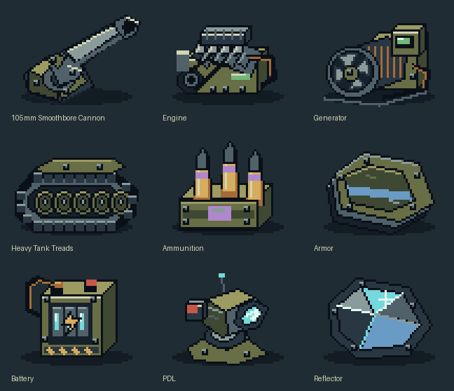

# Vehicle module icons - first pixel-art set



Nine original **64×48 RGBA PNGs**, plus a **256×256 runtime atlas**, in `mods/ca/bits/modular/`.
Chrome textures require power-of-two dimensions: the atlas keeps its 192×144 icon region in the
upper-left corner, with transparent padding and unchanged chrome coordinates. Individual source
icons and the documentation review sheet are not uploaded as standalone chrome textures.

Icons:

- `weapon.png`: smoothbore gun, breech and mount
- `engine.png`: armored diesel engine block
- `generator.png`: alternator, cooling fan and control box
- `gear.png`: heavy tank treads and road wheels
- `ammo.png`: brass rounds in an ammunition crate
- `armor.png`: layered armor plates
- `battery.png`: military power pack
- `pdl.png`: point-defense laser emitter
- `reflector.png`: faceted reflector armor

Style references inspected: `bits/gdi/vehicle_armor.png`, `bits/gdi/energy_weapons.png`,
`bits/nod/improved_lasers.png`, `bits/allies/armoreddoctrineicon.png`. Their commander-tree format is
64×48: dark contours, olive/steel hardware, strong specular highlights and small colored accents.
The new artwork uses hand-authored integer-pixel shapes and material palettes. No original artwork
was copied, altered or used as a generation input. Transparent backgrounds keep the slot colors legible.
This first set covers **module categories**, not a distinct portrait for every supported stock component.

The icons appear on component selectors, in wider option menus, on fitted blocks and on cursor-held
items. Slot outlines and held-item dimensions remain visible; icons stay upright when footprints rotate.
English names remain in the sidebar and selection line. Icon widgets do not intercept mouse input.
No actor spawning, palette changes, electrical simulation or calibration changes are involved.

Regenerate the PNGs, atlas and review sheet with:

```
python tools/modular/generate_module_icons.py
```

Pillow is the only artwork dependency. Source definitions remain editable in the generator.
Tests compare generated pixels, atlas regions, transparency and module coverage. Ingame sizing/style
still needs live review; the review sheet is not a screenshot of the running designer.

Related UI changes in this pass: `Standard Tracks` is now **Heavy Tank Treads** (the shared component's
label only, not a locomotor change), and the schematic's `FRONT -->` text has been removed.
